<h2>TensorFlow-FlexUNet-Image-Segmentation-COVID-19-Infection (2025/08/03)</h2>

This is the first experiment of Image Segmentation for COVID-19 Infection Multiclass,
 based on our 
TensorFlowFlexUNet (TensorFlow Flexible UNet Image Segmentation Model for Multiclass) 
and a 512x512 pixels 
<a href="https://drive.google.com/file/d/1LVQ6rnNO9Wpenqjh9_R7k3b6w_sZqyxC/view?usp=sharing">
Augmented-COVID-19-ImageMask-Dataset.zip</a>.
which was derived by us from 
<a href="https://medicalsegmentation.com/covid19/">
<b>
COVID-19   COVID-19 CT segmentation dataset
</b>
</a>
 
 
<b>Acutual Image Segmentation for 512x512 COVID-19 Infection images</b> 

As shown below, the inferred masks predicted by our segmentation model trained on the 
PNG dataset appear similar to the ground truth masks, but lack precision in some areas, 
 
The green represents a right lung, the blue a left lung, and the red an infection region
respectively. 

 
<table>
<tr>
<th>Input: image</th>
<th>Mask (ground_truth)</th>
<th>Prediction: inferred_mask</th>
</tr>
<tr>
<td>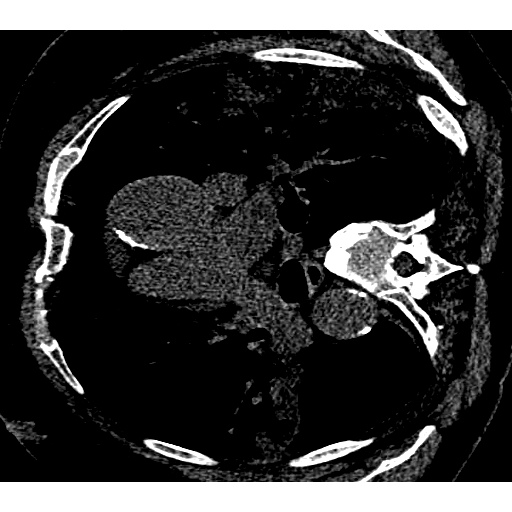</td>
<td></td>
<td></td>
</tr>
<tr>
<td>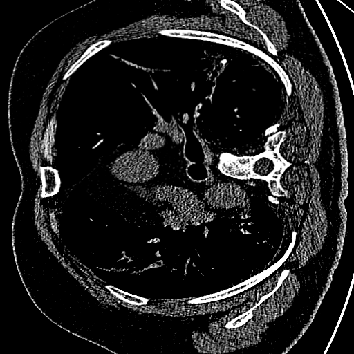</td>
<td>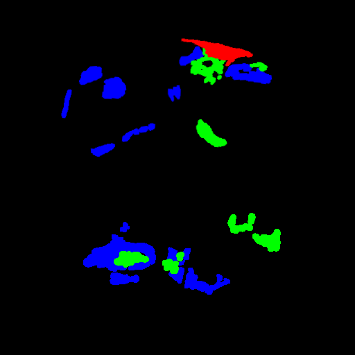</td>
<td>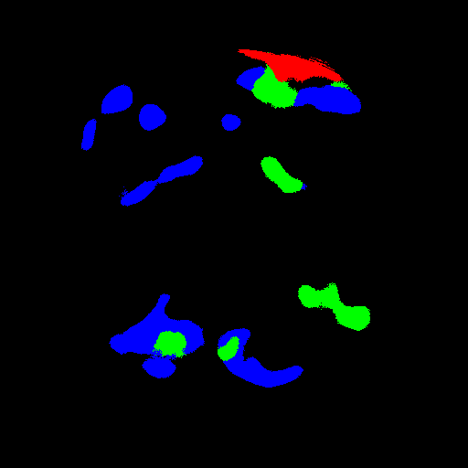</td>
</tr>
<tr>
<td>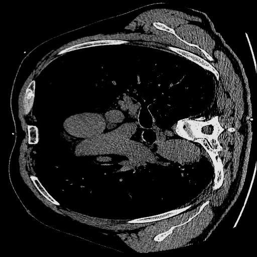</td>
<td></td>
<td>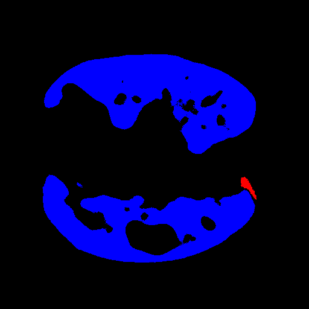</td>
</tr>
</table>

 
<h3>1. Dataset Citation</h3>
The dataset used here has been taken from the web-site: 

<a href="https://medicalsegmentation.com/covid19/">
<b>
COVID-19   COVID-19 CT segmentation dataset
</b>
</a>
 
 
This is a dataset of 100 axial CT images from >40 patients with COVID-19 that were converted from openly accessible JPG images found HERE. The conversion process is described in detail in the following blogpost: Covid-19 radiology — data collection and preparation for Artificial Intelligence
 
In short, the images were segmented by a radiologist using 3 labels: ground-glass (mask value =1), consolidation (=2) and pleural effusion (=3). We then trained a 2d multilabel U-Net model, which you can find and apply in MedSeg. NEW (from 2nd April 2020): Try the Beta fully automated report HERE (DICOM only).
 
Download data: 
Training images as .nii.gz (151.8 Mb) – 100 slices 
Training masks as .nii.gz (1.4 Mb) – 100 masks 
CSV file connecting slice no. with SIRM case no. (0.001 Mb) 
Test images as .nii.gz (14.2 Mb) – 10 slices. Kaggle competition 

 
Comments 
Ground-glass opacities have been shown to precede consolidations. Some reports have shown that 
early and more pronounced findings on CT correlate negatively with prognosis. 
Maybe volumetric measurements and ratio of ground-glass/consolidation can further 
enhance the prognosis estimation for COVID-19 patients. However, as radiologists, we feel it is our obligation to mention that CT should generally NOT be used for broad screening for COVID-19 as a substitute for RT-PCR.
 
You may use the segmentations freely, but we would very much appreciate an acknowledgment/link.

 
 

<h3>
<a id="2">
2 COVID-19 ImageMask Dataset
</a>
</h3>
 If you would like to train this COVID-19 Segmentation model by yourself,
 please download the dataset from the google drive  
<a href="https://drive.google.com/file/d/1LVQ6rnNO9Wpenqjh9_R7k3b6w_sZqyxC/view?usp=sharing">
Augmented-COVID-19-ImageMask-Dataset.zip</a>.
 
, expand the downloaded ImageMaskDataset and put it under <b>./dataset</b> folder to be
<pre>
./dataset
└─COVID-19
    ├─test
    │   ├─images
    │   └─masks
    ├─train
    │   ├─images
    │   └─masks
    └─valid
        ├─images
        └─masks
</pre>
 
<b>COVID-19 Statistics</b> 
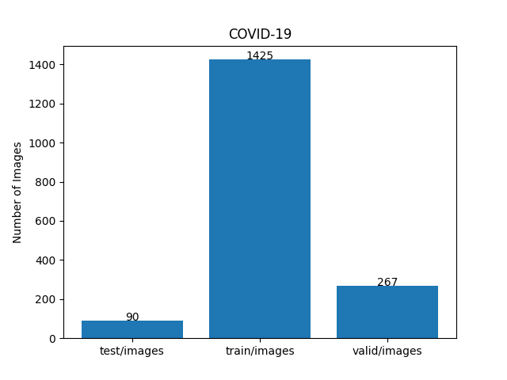 
 
<!--
On the derivation of the dataset, please refer to the following Python scripts: 
<li><a href="./generator/ImageMaskDatasetGenerator.py">ImageMaskDatasetGenerator.py</a></li>
<li><a href="./generator/split_master.py">split_master.py</a></li>
 
-->
As shown above, the number of images of train and valid datasets is not so large to use for a training set of our segmentation model.
 
 
<b>Train_images_sample</b> 
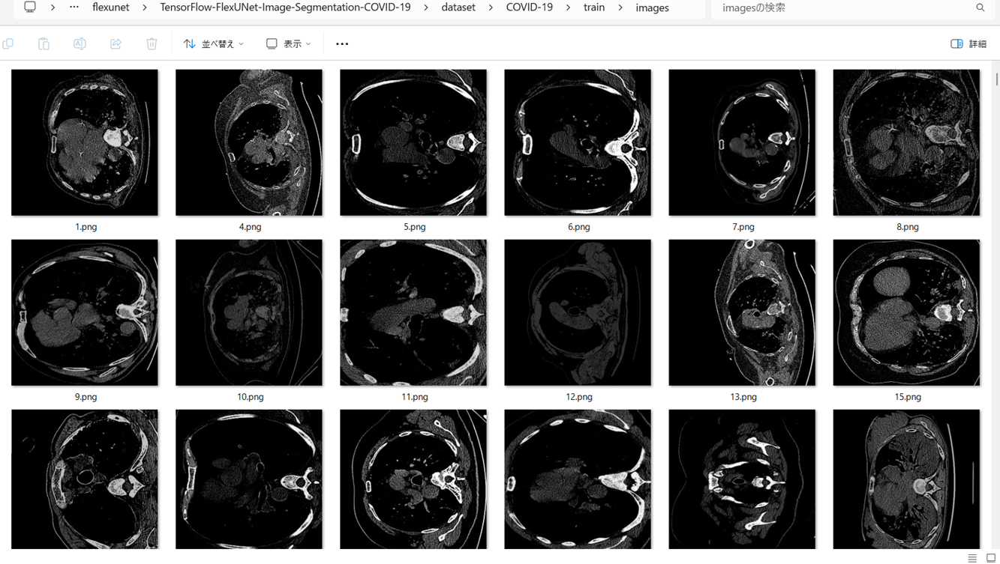
 
<b>Train_masks_sample</b> 
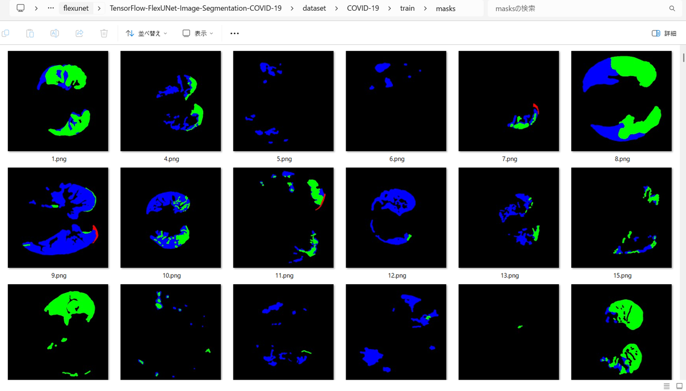
 
<h3>
3 Train TensorFlowFlexUNet Model
</h3>
 We trained COVID-19 TensorFlowFlexUNet Model by using the following
<a href="./projects/TensorFlowFlexUNet/COVID-19/train_eval_infer.config"> <b>train_eval_infer.config</b></a> file.  
Please move to ./projects/TensorFlowFlexUNet/COVID-19 and run the following bat file. 
<pre>
>1.train.bat
</pre>
, which simply runs the following command. 
<pre>
>python ../../../src/TensorFlowFlexUNetTrainer.py ./train_eval_infer.config
</pre>

<b>Model parameters</b> 
Defined a small <b>base_filters = 16 </b> and large <b>base_kernels = (9,9)</b> for the first Conv Layer of Encoder Block of 
<a href="./src/TensorFlowFlexUNet.py">TensorFlowFlexUNet.py</a> 
and a large num_layers (including a bridge between Encoder and Decoder Blocks).
<pre>
[model]
;You may specify your own UNet class derived from our TensorFlowFlexModel
model         = "TensorFlowFlexUNet"
generator     =  False
image_width    = 512
image_height   = 512
image_channels = 3
num_classes    = 4

base_filters   = 16
base_kernels   = (9,9)
num_layers     = 8
dropout_rate   = 0.04
dilation       = (1,1)
</pre>
<b>Learning rate</b> 
Defined a very small learning rate.  
<pre>
[model]
learning_rate  = 0.00007
</pre>
<b>Loss and metrics functions</b> 
Specified "categorical_crossentropy" and <a href="./src/dice_coef_multiclass.py">"dice_coef_multiclass"</a>. 
<pre>
[model]
loss           = "categorical_crossentropy"
metrics        = ["dice_coef_multiclass"]
</pre>
<b>Dataset class</b> 
Specifed <a href="./src/ImageCategorizedMaskDataset.py">ImageCategorizedMaskDataset</a> class. 
<pre>
[dataset]
class_name    = "ImageCategorizedMaskDataset"
</pre>
 
<b>Learning rate reducer callback</b> 
Enabled learing_rate_reducer callback, and a small reducer_patience.
<pre> 
[train]
learning_rate_reducer = True
reducer_factor     = 0.4
reducer_patience   = 4
</pre>
<b>Early stopping callback</b> 
Enabled early stopping callback with patience parameter.
<pre>
[train]
patience      = 10
</pre>

<b>RGB Color map</b> 
rgb color map dict for COVID-19 1+3 classes. 
<pre>
[mask]
mask_file_format = ".png"
; 1+3 classes
; categories  = ["right lung", "left lung", "infection"]
; RGB colors         right_lung:green,left_lung:blue,  infection:red     
rgb_map = {(0,0,0):0,(0,255,0):1,     (0,0, 255):2,    (255, 0, 0):3, }

</pre>

<b>Epoch change inference callback</b> 
Enabled <a href="./src/EpochChangeInfereuncer.py">epoch_change_infer callback</a></b>. 
<pre>
[train]
epoch_change_infer       = True
epoch_change_infer_dir   =  "./epoch_change_infer"
num_infer_images         = 6
</pre>

By using this callback, on every epoch_change, the inference procedure can be called
 for 6 images in <b>mini_test</b> folder. This will help you confirm how the predicted mask changes 
 at each epoch during your training process.    

<b>Epoch_change_inference output at starting (epoch 1,2,3)</b> 
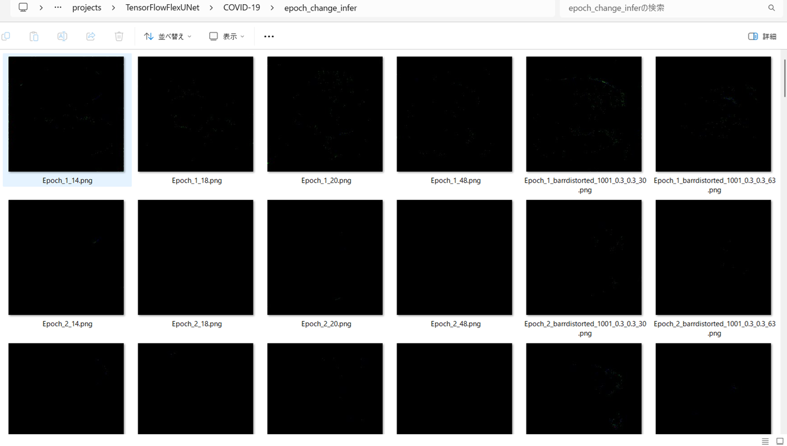 
 
<b>Epoch_change_inference output at middlepoint (epoch 16,17,18)</b> 
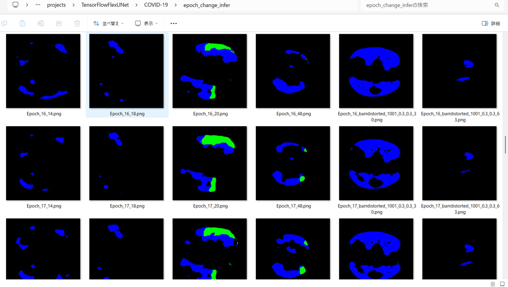 
 
<b>Epoch_change_inference output at ending (epoch 34,35,36)</b> 
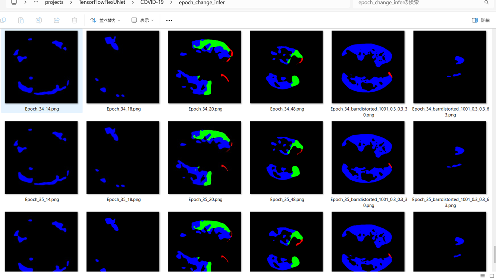 
 
In this experiment, the training process was terminated at epoch 36.  
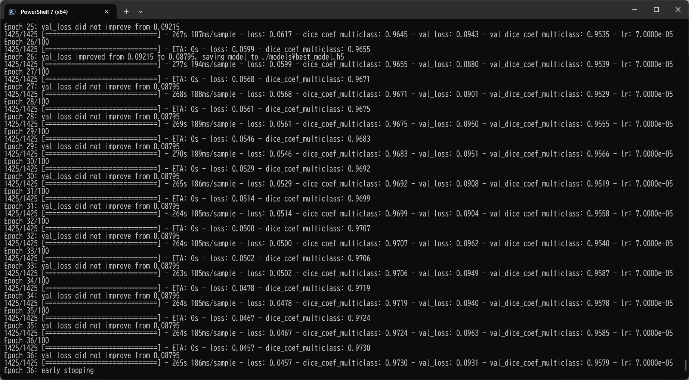 
 

<a href="./projects/TensorFlowFlexUNet/COVID-19/eval/train_metrics.csv">train_metrics.csv</a> 
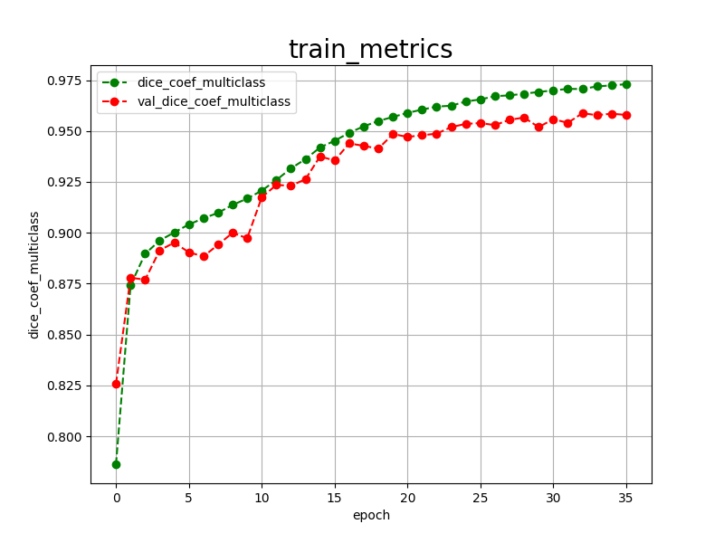 

 
<a href="./projects/TensorFlowFlexUNet/COVID-19/eval/train_losses.csv">train_losses.csv</a> 
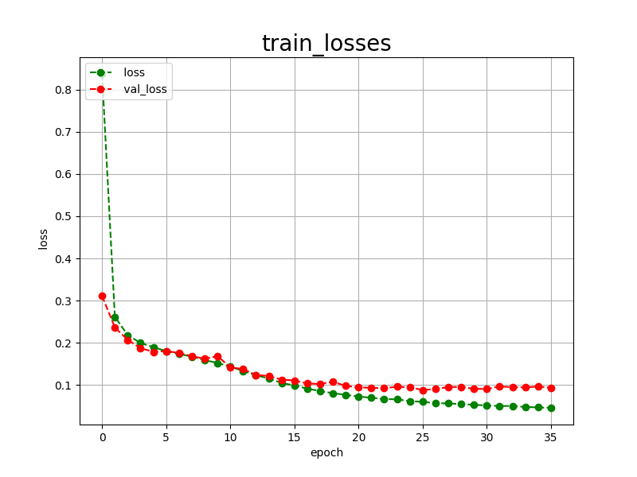 

 

<h3>
4 Evaluation
</h3>
Please move to <b>./projects/TensorFlowFlexUNet/COVID-19</b> folder, 
and run the following bat file to evaluate TensorFlowFlexUNet model for COVID-19. 
<pre>
./2.evaluate.bat
</pre>
This bat file simply runs the following command.
<pre>
python ../../../src/TensorFlowFlexUNetEvaluator.py ./train_eval_infer_aug.config
</pre>

Evaluation console output: 
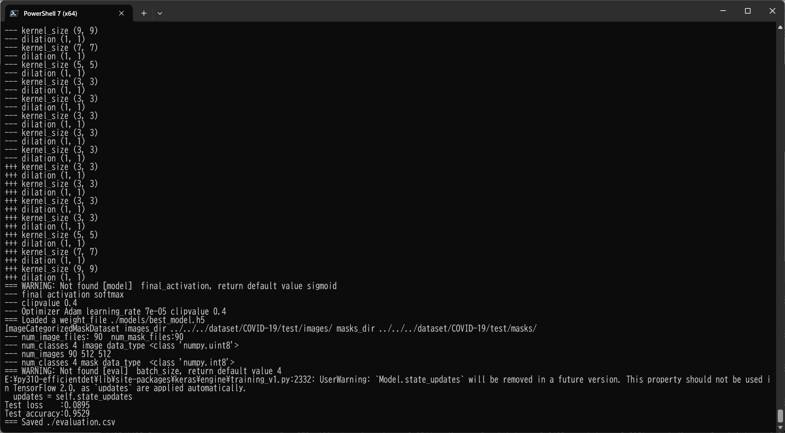
  

<a href="./projects/TensorFlowFlexUNet/COVID-19/evaluation.csv">evaluation.csv</a> 
The loss (categorical_crossentropy) to this COVID-19/test was low and dice_coef_multiclass 
high as shown below.
 
<pre>
categorical_crossentropy,0.0895
dice_coef_multiclass,0.9529
</pre>
 

<h3>
5 Inference
</h3>
Please move <b>./projects/TensorFlowFlexUNet/COVID-19</b> folder 
,and run the following bat file to infer segmentation regions for images by the Trained-TensorFlowFlexUNet model for COVID-19. 
<pre>
./3.infer.bat
</pre>
This simply runs the following command.
<pre>
python ../../../src/TensorFlowFlexUNetInferencer.py ./train_eval_infer_aug.config
</pre>

<b>mini_test_images</b> 
 
<b>mini_test_mask(ground_truth)</b> 
 

<b>Inferred test masks</b> 
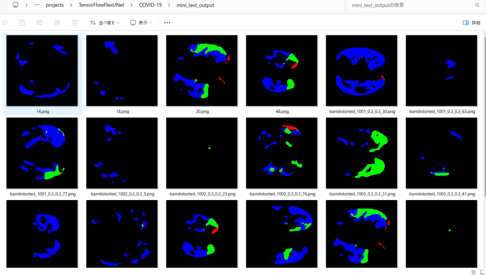 
 

<b>Enlarged images and masks of 512x512 pixels</b> 
The green represents a consep, the yellow a crag, the cyan a dpath, the red a glas, and the blue a pannuke respectively.  
<table>
<tr>
<th>Image</th>
<th>Mask (ground_truth)</th>
<th>Inferred-mask</th>
</tr>

<tr>
<td></td>
<td></td>
<td></td>
</tr>

<tr>
<td>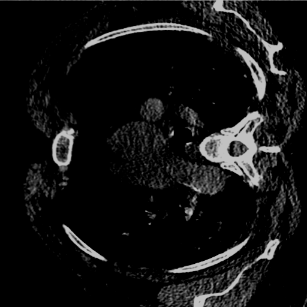</td>
<td>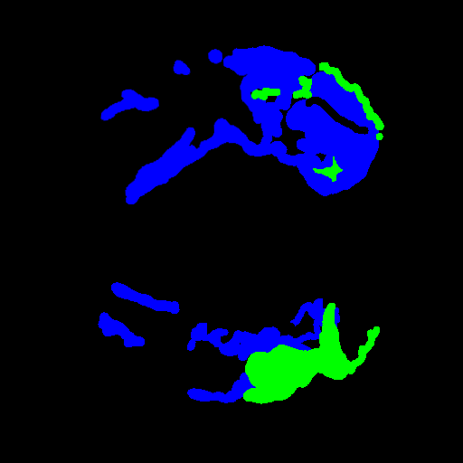</td>
<td>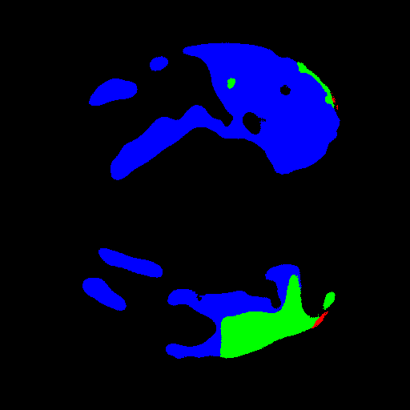</td>
</tr>

<tr>
<td></td>
<td></td>
<td></td>
</tr>

<tr>
<td>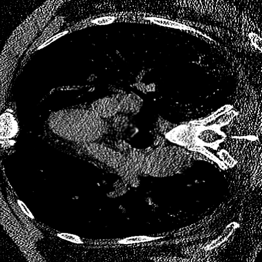</td>
<td>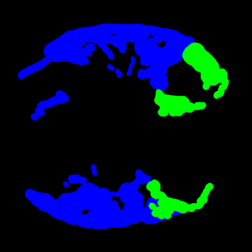</td>
<td>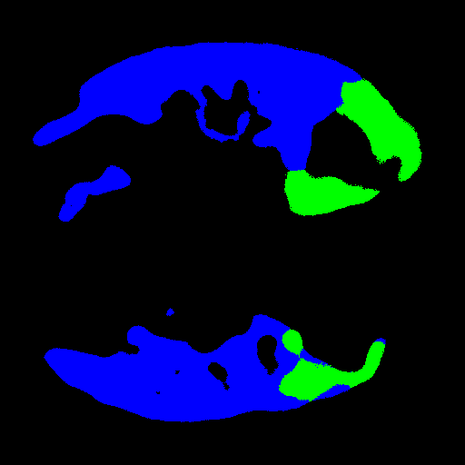</td>
</tr>

<tr>
<td>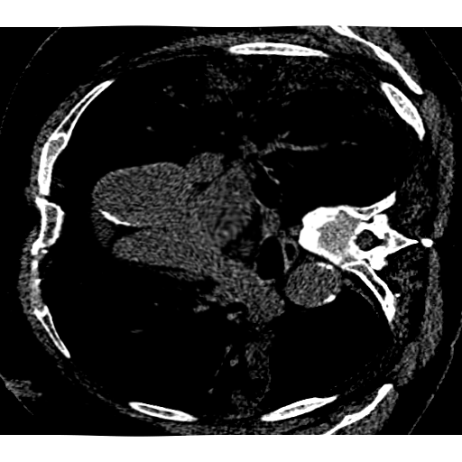</td>
<td>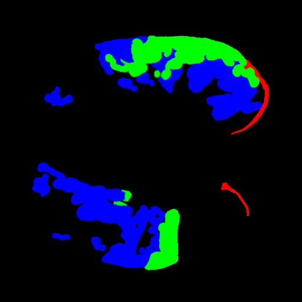</td>
<td>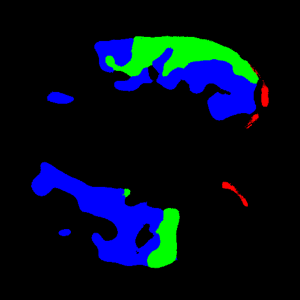</td>
</tr>

<tr>
<td>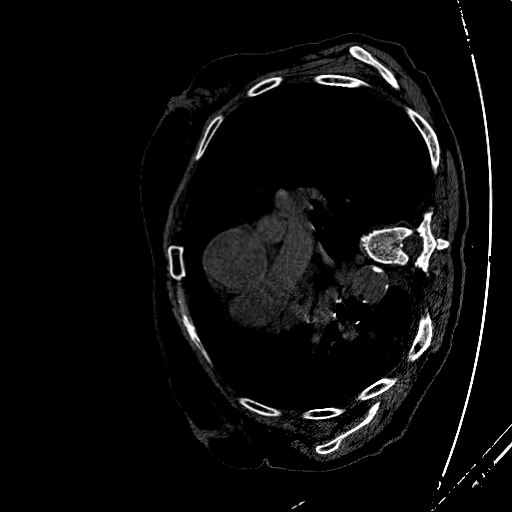</td>
<td>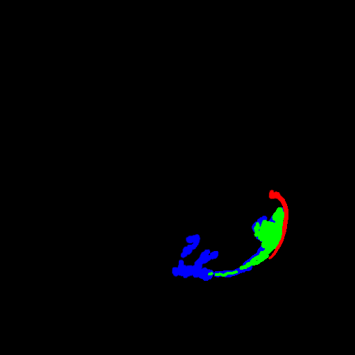</td>
<td>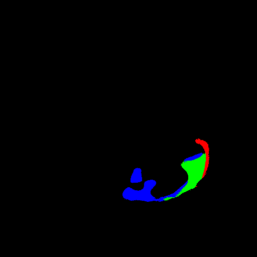</td>
</tr>
</table>

 
<h3>
References
</h3>

<b>1. COVID-19 infection segmentation using hybrid deep learning and image processing techniques</b>
Samar Antar, Hussein Karam Hussein Abd El-Sattar, Mohammad H. Abdel-Rahman & Fayed F. M. Ghaleb   

<a href="https://www.nature.com/articles/s41598-023-49337-1">
https://www.nature.com/articles/s41598-023-49337-1
</a>

 
 
<b>2. COVID-19 Infection Segmentation and Severity Assessment Using a Self-Supervised Learning Approach</b>
 
 Yao Song,Jun Liu,Xinghua Liu  and Jinshan Tang 
<a href="https://www.mdpi.com/2075-4418/12/8/1805">
https://www.mdpi.com/2075-4418/12/8/1805
</a>
 
 

<b>3. COVID-19 lung infection segmentation with a novel two-stage cross-domain transfer learning framework</b>
 
Jiannan Liu, Bo Dong, Shuai Wang, Hui Cui, Deng-Ping Fan, Jiquan Ma, Geng Chen  

<a href="https://www.sciencedirect.com/science/article/pii/S1361841521002504">
https://www.sciencedirect.com/science/article/pii/S1361841521002504
</a>
 
 

<b>4. Inf-Net: Automatic COVID-19 Lung Infection Segmentation From CT Images</b> 
Deng-Ping Fan, Tao Zhou, Ge-Peng Ji, Yi Zhou, Geng Chen, Huazhu Fu, Jianbing Shen, Ling Shao 
<a href="https://ieeexplore.ieee.org/document/9098956">
https://ieeexplore.ieee.org/document/9098956
</a>

